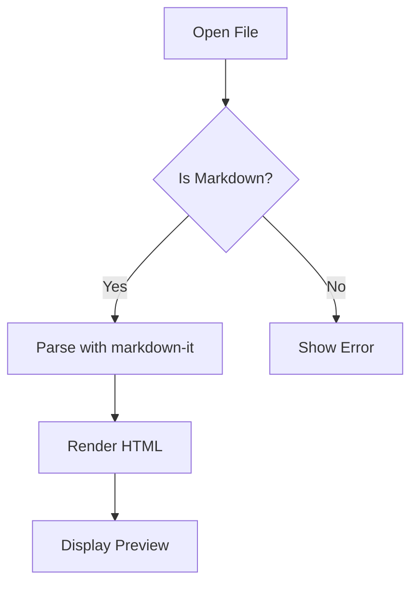
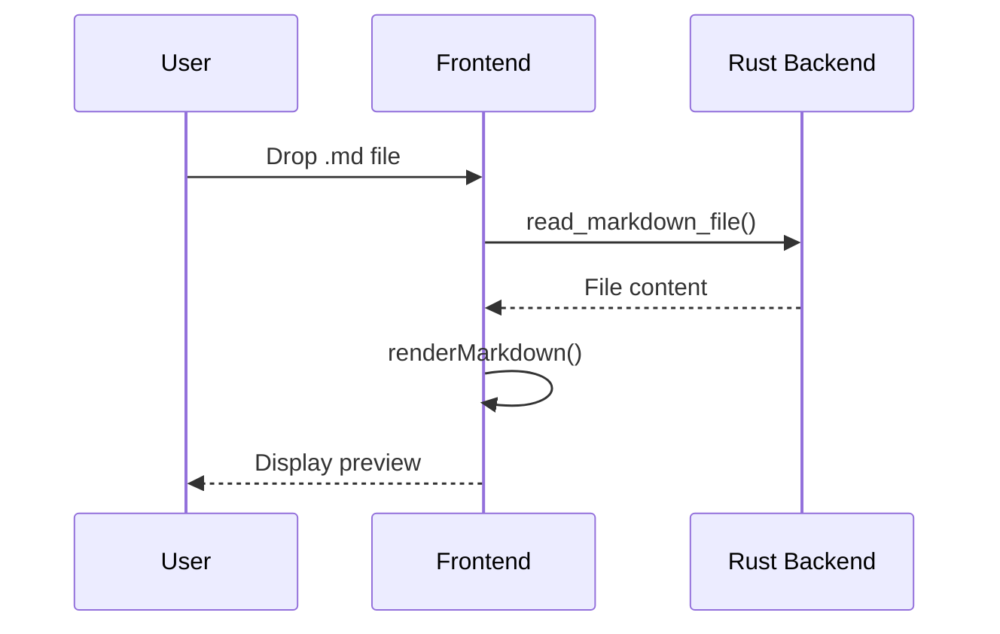

# md-view Feature Test

This document tests all supported Markdown features.

## Text Formatting

This is **bold**, *italic*, ~~strikethrough~~, and `inline code`.

This is a [link](https://example.com) and an auto-linked URL: https://example.com

## Task Lists

- [x] Completed task
- [ ] Pending task
- [x] Another done item
- [ ] Yet another todo

## Tables

| Feature | Status | Notes |
|---------|--------|-------|
| GFM Tables | ✅ | Built-in |
| Task Lists | ✅ | Plugin |
| Footnotes | ✅ | Plugin |
| Emoji | ✅ | :tada: |

## Code Blocks

```javascript
function fibonacci(n) {
  if (n <= 1) return n;
  return fibonacci(n - 1) + fibonacci(n - 2);
}

console.log(fibonacci(10)); // 55
```

```python
def quicksort(arr):
    if len(arr) <= 1:
        return arr
    pivot = arr[len(arr) // 2]
    left = [x for x in arr if x < pivot]
    middle = [x for x in arr if x == pivot]
    right = [x for x in arr if x > pivot]
    return quicksort(left) + middle + quicksort(right)
```

```rust
fn main() {
    println!("Hello from Rust!");
    let v: Vec<i32> = (1..=10).filter(|x| x % 2 == 0).collect();
    println!("{:?}", v);
}
```

## Math Formulas

Inline math: $E = mc^2$

Block math:

$$
\int_{-\infty}^{\infty} e^{-x^2} dx = \sqrt{\pi}
$$

$$
\sum_{n=1}^{\infty} \frac{1}{n^2} = \frac{\pi^2}{6}
$$

## Mermaid Diagrams





## Footnotes

This is a sentence with a footnote[^1].

Another footnote reference[^note].

[^1]: This is the first footnote.
[^note]: This is a named footnote with more detail.

## Emoji

:rocket: :star: :heart: :tada: :100:

## GitHub Alerts

> [!NOTE]
> This is a note alert — useful for highlighting information.

> [!TIP]
> This is a tip alert — helpful advice for users.

> [!IMPORTANT]
> This is an important alert — key information to keep in mind.

> [!WARNING]
> This is a warning alert — potential issues to be aware of.

> [!CAUTION]
> This is a caution alert — dangerous actions or consequences.

## Blockquotes

> This is a regular blockquote.
> It can span multiple lines.
>
> > And can be nested.

## Lists

### Ordered
1. First item
2. Second item
   1. Sub-item A
   2. Sub-item B
3. Third item

### Unordered
- Item one
- Item two
  - Sub-item
  - Another sub-item
- Item three

## Images


## Horizontal Rule

---

## Heading Levels

### H3 Heading
#### H4 Heading
##### H5 Heading
###### H6 Heading

---

*End of feature test document.*
